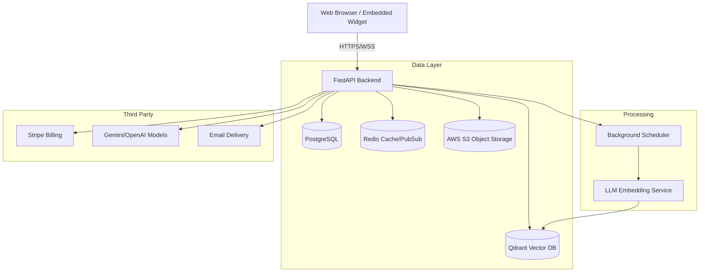

# Architecture Overview

SupportGPT utilizes a modern, event-driven SaaS architecture to handle real-time customer interactions and heavy ML workloads asynchronously.

## High-Level Components

## 1. Application Layer
- **Frontend**: Next.js App Router handling SSR and CSR.
- **Backend**: FastAPI providing REST endpoints and WebSocket channels for real-time chat.
- **Event Bus**: Internal Python PubSub utilizing SQLAlchemy hooks to trigger Automations (e.g., When Ticket Created -> Fire Webhook).

## 2. RAG (Retrieval-Augmented Generation) Pipeline
1. **Ingestion**: User uploads PDF. Saved to S3.
2. **Extraction**: Text is extracted and chunked using Langchain text splitters.
3. **Embedding**: Chunks are embedded using OpenAI `text-embedding-3-small`.
4. **Storage**: Vectors and metadata are stored in Qdrant.
5. **Retrieval**: User asks question. Embedded question performs cosine similarity search on Qdrant. Context is injected into the prompt for the Gemini 1.5 LLM.

## 3. Real-Time Messaging
- WebSockets (`/api/v1/conversations/ws`) connect the frontend chat widget to the backend.
- Redis PubSub routes messages across horizontal FastAPI instances to ensure agents and customers in the same conversation receive instant updates regardless of which pod they connect to.
