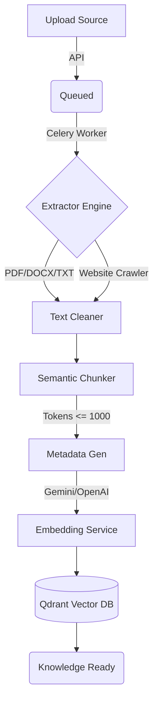

# Knowledge Base & Ingestion Pipeline

## Architecture Overview

The Knowledge Base in SupportGPT AI transforms raw unstructured data (PDF, DOCX, TXT, Website URLs) into searchable, vector-embedded knowledge ready for RAG (Retrieval-Augmented Generation).

### Flow Diagram

## Storage Strategy

- **Raw Files**: Uploaded directly to Object Storage via `storage_service.py` (Local/S3).
- **Relational Data**: PostgreSQL stores:
  - `Document`: Metadata about the uploaded source.
  - `ExtractionResult`: The raw and cleaned text, alongside language detection.
  - `DocumentChunk`: Text chunks and their token size.
  - `ProcessingJob`: The state of the async job (Queued -> Processing -> Completed).
- **Vector Data**: Qdrant stores the 768-dimensional float arrays alongside rich payload metadata for filtering.

## Chunking Strategy

- **Tool**: `tiktoken` (cl100k_base).
- **Method**: Recursive character splitting with a bias for paragraph preservation.
- **Parameters**: 
  - Max Tokens: 1000
  - Overlap: 200 tokens
- **Metadata**: Each chunk receives its parent `document_id`, `chunk_index`, `source_type`, and `language`.

## Embedding Strategy

- **Provider**: Agnostic abstraction (`EmbeddingProvider`), currently backing onto `google-generativeai`.
- **Batching**: Vectors are generated and upserted in batches of 100 to avoid rate limits and payload size issues.

## Qdrant Structure

- **Collection Definition**: Isolated by Workspace (e.g., `supportgpt_workspace_uuid`).
- **Distance Metric**: Cosine Similarity.
- **Payload Indexing**: Filterable indices created on `document_id`, `source_type`, and `language` to optimize search latency when filtering contexts.

## Processing Workflow

1. **User Action**: The frontend POSTs a file to `/knowledge/upload` or a URL to `/knowledge/website`.
2. **FastAPI Node**: 
   - Saves the file.
   - Creates a Postgres `Document` record.
   - Creates a `ProcessingJob`.
   - Enqueues `process_document_task` or `process_website_task` via Celery to the Redis broker.
3. **Celery Worker Node**:
   - `tasks.process_document` dequeues the job.
   - `extraction_service` parses the file.
   - `TextCleaner` sanitizes whitespace and artifacts.
   - `semantic_chunker` generates `ChunkResult` objects.
   - State updates in Postgres.
   - Enqueues `tasks.generate_embeddings`.
4. **Celery Embedding Node**:
   - Fetches chunks.
   - Generates float arrays.
   - Upserts into Qdrant.
   - Marks Document `READY`.
